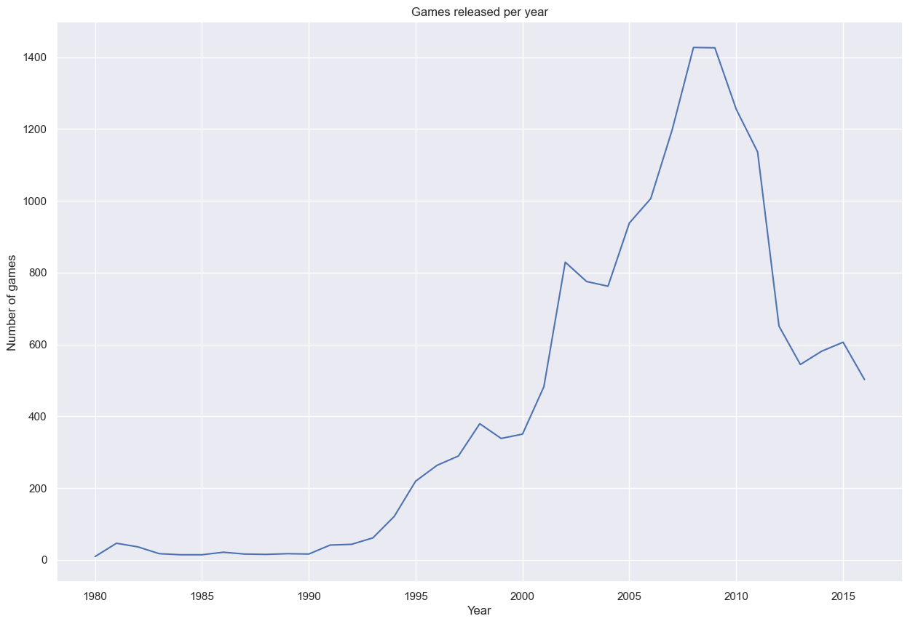
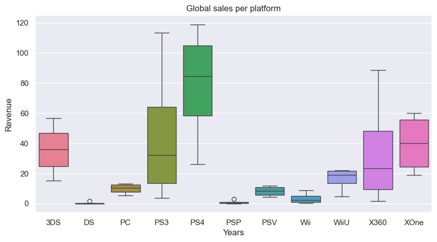
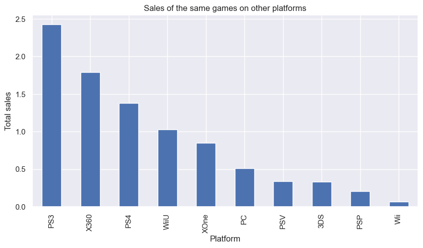
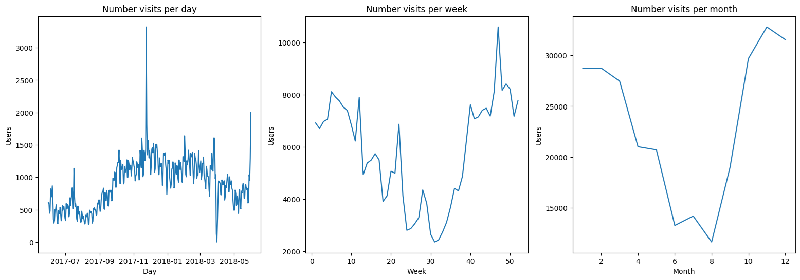

# Acerca de mí
ANALISTA DE DATOS | DE LA INFORMACIÓN A LA ACCIÓN

Soy Analista de Datos con una misión clara:
convertir la información en decisiones más inteligentes, más ágiles y más seguras.

- Limpio, integro y valido datos con precisión.
- Automatizo tareas y flujos para ganar tiempo y eficiencia.
- Diseño reportes claros que conectan directamente con lo que el negocio necesita decidir.

¿Qué me diferencia?
No me quedo en lo técnico. Mi trabajo termina cuando tú puedes tomar decisiones con total confianza en la información.

Además, gracias a mi experiencia docente, sé comunicar lo complejo de forma simple, accesible y útil.

Entender los datos no es un lujo, es una necesidad.
Y contar con alguien que los convierta en resultados puede cambiar por completo la forma en que creces y mejoras.

Si estás buscando a alguien que entienda los datos y sepa usarlos con sentido estratégico, hablemos.

📩 Estoy listo para ayudarte a llevar el análisis a otro nivel.

### Habilidades técnicas

- Excel avanzado (Power Query, Tablas dinámicas, fórmulas complejas)

- SQL (Consultas, Joins, Limpieza y Transformación de datos)

- Tableau (Modelado de datos, Dashboards interactivos)

- Python (Pandas, Numpy, Scipy, Matplotlib, Seaborn)

- Google Sheets (Formularios conectados, Tablas dinámicas, fórmulas inteligentes)

- Git, GitHub, Visual Studio Code, Docker

### Competencias

- **Pensamiento crítico:** Analizo con profundidad, separo lo importante de lo irrelevante y conecto los datos.

- **Atención al detalle:** Me enfoco en la precisión porque sé que un solo dato puede cambiar el rumbo de una estrategia. 

- **Trabajo en equipo:** Me adapto y colaboro con perfiles diversos, entendiendo que los mejores resultados nacen del intercambio de ideas bien comunicadas.
  
- **Adaptabilidad:** Me muevo con soltura entre distintos entornos, industrias y herramientas.

- **Comunicación efectiva:** Traduzco lo técnico en claro. Lo complejo en útil.
  
- **Curiosidad:** No me conformo con lo básico. Siempre busco entender más allá, encontrar patrones, descubrir oportunidades.

- **Resolución de Problemas:** No me detengo en el “qué pasó”, voy al “por qué” y sobre todo al “cómo lo resolvemos”.

  
  

    

# Proyectos

### ¿Qué hace exitoso a un videojuego? Un estudio de datos para Ice Store

#### Objetivo del proyecto
Identificar los factores clave que determinan el éxito comercial de un videojuego a partir del análisis de datos históricos (reseñas, géneros, plataformas, ventas, etc.), con el fin de:

- Predecir el potencial de nuevos lanzamientos

- Optimizar decisiones de marketing

- Detectar oportunidades para campañas publicitarias efectivas

#### Lenguaje de programación, librerías y habilidades 

#### Preguntas clave
- Mira cuántos juegos fueron lanzados en diferentes años. ¿Son significativos los datos de cada período?

- ¿Qué plataformas son líderes en ventas? ¿Cuáles crecen y cuáles se reducen? Elige varias plataformas potencialmente rentables.

- Echa un vistazo a la distribución general de los juegos por género. ¿Qué se puede decir de los géneros más rentables? ¿Puedes generalizar acerca de los géneros con ventas altas y bajas?

#### Metodología 
- **Preprocesamiento de datos:** Se limpiaron y ajustaron los datos: se corrigieron tipos, se eliminaron duplicados y se trataron valores faltantes (como los marcados como “TBD”). También se creó una nueva columna que sumaba las ventas totales por juego, unificando todas las regiones.

- **Análisis exploratorio de datos (EDA):** Se revisó la cantidad de juegos por año, las plataformas con más ventas y cómo cambian con el tiempo. También se analizaron géneros, calificaciones y diferencias regionales. Se usaron visualizaciones y estadísticas básicas para entender los patrones más importantes.

- **Análisis estadístico de datos:** Se hicieron comparaciones entre plataformas y géneros, usando pruebas de hipótesis. Se midieron relaciones entre calificaciones y ventas para entender si influyen en el éxito. Todo con base en datos reales y evidencia clara.

#### Conclusión general
Este proyecto ha permitido construir una base sólida de análisis a partir de datos bien preparados y explorados, lo que permitió generar un modelo confiable para el año 2017.
Gracias a este trabajo, quienes toman decisiones dentro del negocio cuentan con información útil para identificar juegos prometedores, planear campañas más efectivas y maximizar los resultados.

Los hallazgos obtenidos no solo mejoran el rendimiento a corto plazo, sino que también aportan valor estratégico a largo plazo en un sector altamente competitivo y rentable como el de los videojuegos.

#### Visualizaciones destacadas
- **Evolución del número de videojuegos lanzados por año a lo largo del tiempo:** El sector vivió un crecimiento sostenido desde 1995, con un boom entre 2000 y 2009 impulsado por la revolución tecnológica. Sin embargo, la Gran Recesión causada por la crisis hipotecaria de EE.UU. provocó una fuerte caída en la producción y ventas, afectando gravemente a la industria de los videojuegos y otros sectores de consumo.

- **Distribución de las ventas globales:** PlayStation lidera las ventas con sus consolas PS4 y PS3, seguido por Xbox (XOne y X360) y Nintendo con la 3DS, siendo estrecha la diferencia entre estas dos últimas.Las demás plataformas tienen ventas poco representativas, destacando entre las menos rentables Wii U, PC, PSV, PSP y DS. Las ventas promedio variaron: en la mayoría, el mayor porcentaje se dio entre el PRIMERO y SEGUNDO cuartil, en otras entre el SEGUNDO  y TERCERO, y sólo 3DS, PSV y XOne se mantuvieron en un nivel promedio.

- **Comparación de ventas de los mismos videojuegos en otras plataformas:** La visualización muestra como se comportan las ventas de los mismos videojuegos en otras plataformas, destacando la consola PS3 de PlayStation como líder, seguida por la X360 de Xbox y la PS4. Se observa una variación considerable entre plataformas, salvo en el caso de PSV y 3DS, que mantienen una competencia cerrada. Aunque hay juegos disponibles en múltiples consolas, este segmento representa solo una pequeña parte del total de ventas por plataforma.

**Te invito a visitar el** [repositorio completo.](https://github.com/urielvelazquez/proyecto-integrado-videojuegos/tree/main)

### ¿Cuándo un cliente empieza a valer la inversión? Un viaje por los datos de Showz

#### Objetivo del proyecto
Analizar el comportamiento de los usuarios y los datos históricos de ventas, visitas y marketing para:

- Identificar fuentes de adquisición de clientes más rentables

- Calcular métricas clave como CAC, LTV y ROMI

- Determinar el momento en que los ingresos compensan el costo de adquisición

- Optimizar estrategias de marketing para mejorar la rentabilidad y eficiencia de futuras campañas

#### Lenguaje de programación, librerías y habilidades 

#### Preguntas clave
- ¿Cuántas personas usan el sitio web diariamente, semanalmente y mensualmente?

- ¿Qué canales de adquisición generan clientes con mayor LTV?

- ¿Qué combinación de fuente más dispositivo muestra mejor rendimiento?

- ¿Qué métricas son determinantes para decidir en qué canales se debe invertir?
  
#### Metodología 
- **Preprocesamiento de datos:** Se limpiaron y ajustaron los datos: se corrigieron tipos, se eliminaron duplicados y se trataron valores faltantes.

- **Análisis del Comportamiento de Usuarios:** Se estudiaron métricas clave como Usuarios Activos Diarios (DAU), Usuarios Activos Semanales (WAU) y Usuarios Activos Mensuales (MAU), así como la duración promedio de las sesiones y la frecuencia de retorno de los usuarios, para comprender cómo interactúan con la plataforma.

- **Análisis de Ventas:** Se evaluó el momento en que los usuarios comienzan a comprar, el tamaño promedio de compra, el número de pedidos por cliente y el Valor de Vida del Cliente (LTV), con el fin de identificar patrones de consumo.

- **Evaluación de Estrategias de Marketing:** Se calcularon métricas como el Costo de Adquisición de Clientes (CAC), el Retorno de la Inversión en Marketing (ROMI) y los costos por fuente de adquisición, para identificar los canales más rentables y orientar la toma de decisiones estratégicas.

#### Conclusión general
El análisis realizado permitió evaluar las estrategias de marketing con base en métricas clave como el CAC (Costo de Adquisición de Clientes), el ROMI (Retorno de la Inversión en Marketing) y el LTV (Valor del Ciclo de Vida del Cliente). Estas métricas revelaron insights sólidos para la optimización de campañas y asignación de presupuesto.

#### Recomendaciones
- Fuente 1: por su estabilidad y eficiencia, ideal para estrategias sostenidas a largo plazo.

- Fuente 2: por su consistencia en resultados y bajo CAC, representa una inversión inteligente y continua.

- Fuente 4: puede ser rentable en periodos de alta demanda, pero requiere seguimiento constante para asegurar que su alto CAC se compense con un LTV favorable.

Es clave diversificar la inversión entre fuentes estables y fuentes de alto impacto, adaptando la estrategia a las condiciones del mercado. Mientras el LTV se mantenga elevado, es válido invertir incluso en canales con CAC más alto, siempre que el ROMI siga siendo positivo.

#### Visualizaciones destacadas
- **Evolución del tráfico de usuarios en la plataforma Showz:** Después de analizar las visitas por días, semanas y meses, se observa un movimiento constante con subidas y bajadas marcadas en cada periodo. El pico más alto de tráfico ocurre entre la tercera semana de noviembre y la segunda de diciembre. Durante las vacaciones de verano, las visitas disminuyen, ya que los usuarios priorizan actividades sociales y recreativas.

